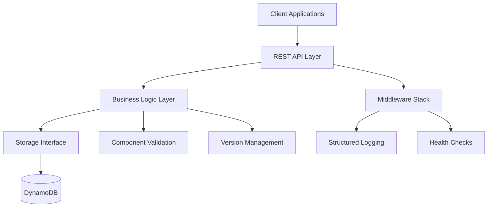

# Catalog Service MVP Design Document

## Overview

The Catalog Service MVP is a REST API service that provides centralized storage and retrieval of infrastructure component definitions for the Nestor platform. The service acts as a component registry where platform teams can store validated infrastructure resource definitions and developers can discover and consume these components.

The design emphasizes modularity, extensibility, and clean architecture principles to support future growth while delivering core functionality through a simple, well-defined API.

## Architecture

### High-Level Architecture



### Architectural Principles

1. **Dependency Inversion**: Business logic depends on abstractions, not concrete implementations
2. **Single Responsibility**: Each layer has a clear, focused purpose
3. **Open/Closed**: Extensible for new storage backends without modifying existing code
4. **Interface Segregation**: Clean, focused interfaces for different concerns
5. **Dependency Injection**: Runtime configuration of dependencies through factory patterns

### Layer Responsibilities

- **API Layer**: HTTP request/response handling, routing, middleware orchestration
- **Business Logic Layer**: Component operations, validation, version management
- **Storage Layer**: Data persistence abstraction with pluggable backends
- **Infrastructure Layer**: Configuration, logging, health checks, observability

## Components and Interfaces

### Core Interfaces

#### Component Storage Interface
```go
type ComponentStore interface {
    GetComponent(ctx context.Context, name, version string) (*models.Component, error)
    ListComponents(ctx context.Context, filters ComponentFilters, pagination Pagination) (*ComponentList, error)
    StoreComponent(ctx context.Context, component *models.Component) error
    GetVersionHistory(ctx context.Context, name string) ([]models.Version, error)
    HealthCheck(ctx context.Context) error
}
```

#### Component Service Interface
```go
type ComponentService interface {
    RetrieveComponent(ctx context.Context, name, version string) (*models.Component, error)
    ListComponents(ctx context.Context, req ListRequest) (*ListResponse, error)
    ValidateAndStore(ctx context.Context, component *models.Component) error
    GetVersionHistory(ctx context.Context, name string) (*VersionHistoryResponse, error)
}
```

### API Components

#### REST Handlers
- **ComponentHandler**: Manages component CRUD operations
- **HealthHandler**: Provides health and readiness endpoints
- **MiddlewareStack**: Request logging, error handling, CORS, rate limiting

#### Request/Response Models
- **ComponentRequest**: Input validation and deserialization
- **ComponentResponse**: Consistent output formatting
- **ErrorResponse**: Standardized error structure with correlation IDs
- **PaginationResponse**: Consistent pagination metadata

### Business Logic Components

#### Component Service
- **Validation Engine**: Schema validation, semantic version checking, metadata verification
- **Version Resolver**: Latest version resolution, semantic version constraint matching
- **Business Rules**: Deprecation handling, filtering logic, data transformation

#### Storage Factory
- **Backend Registration**: Dynamic storage backend selection
- **Configuration Mapping**: Environment-specific storage configuration
- **Health Monitoring**: Storage connectivity verification

### Storage Components

#### DynamoDB Implementation
- **Connection Management**: AWS SDK configuration, connection pooling
- **Query Optimization**: Efficient access patterns for component retrieval
- **Error Translation**: AWS-specific errors to domain errors
- **Batch Operations**: Optimized bulk operations where applicable

## Data Models

### Component Model
```go
type Component struct {
    Name        string            `json:"name" validate:"required"`
    Version     string            `json:"version" validate:"required,semver"`
    Provider    string            `json:"provider" validate:"required"`
    Category    string            `json:"category" validate:"required"`
    Description string            `json:"description"`
    Inputs      []InputSpec       `json:"inputs" validate:"required"`
    Outputs     []OutputSpec      `json:"outputs" validate:"required"`
    Deployment  DeploymentSpec    `json:"deployment" validate:"required"`
    Metadata    ComponentMetadata `json:"metadata"`
    CreatedAt   time.Time         `json:"created_at"`
    UpdatedAt   time.Time         `json:"updated_at"`
}
```

### Version Management
```go
type Version struct {
    Version     string    `json:"version"`
    CreatedAt   time.Time `json:"created_at"`
    GitCommit   string    `json:"git_commit,omitempty"`
    Deprecated  bool      `json:"deprecated"`
    DeprecatedAt *time.Time `json:"deprecated_at,omitempty"`
}
```

### Storage Schema Design

#### DynamoDB Table Structure
- **Primary Key**: `component_name` (Partition Key) + `version` (Sort Key)
- **Global Secondary Index**: `provider-category-index` for filtering
- **Local Secondary Index**: `name-created_at-index` for version history
- **Attributes**: JSON document storage for component definitions

**Rationale**: This design supports efficient single-component lookups, version queries, and filtered browsing while maintaining cost-effectiveness for the MVP scope.

## Error Handling

### Error Classification
1. **Validation Errors (400)**: Invalid input data, schema violations
2. **Not Found Errors (404)**: Missing components or versions
3. **Storage Errors (500)**: Database connectivity, timeout issues
4. **Rate Limiting (429)**: Request throttling protection

### Error Response Structure
```go
type ErrorResponse struct {
    Code      string            `json:"code"`
    Message   string            `json:"message"`
    Details   map[string]string `json:"details,omitempty"`
    TraceID   string            `json:"trace_id"`
    Timestamp time.Time         `json:"timestamp"`
}
```

### Error Handling Strategy
- **Graceful Degradation**: Service continues operating with reduced functionality during partial failures
- **Circuit Breaker**: Protection against cascading storage failures
- **Retry Logic**: Exponential backoff for transient storage errors
- **Correlation Tracking**: Request tracing through structured logging

**Rationale**: Comprehensive error handling ensures reliable service operation and provides clear feedback for debugging and client error handling.

## Testing Strategy

### Unit Testing
- **Service Layer**: Business logic validation, version resolution, filtering
- **Storage Layer**: Mock-based testing of storage operations
- **API Layer**: Handler testing with test doubles
- **Validation**: Schema validation and business rule enforcement

### Integration Testing
- **Storage Integration**: Real DynamoDB operations with test containers
- **API Integration**: End-to-end request/response testing
- **Configuration Testing**: Environment-specific configuration validation

### Contract Testing
- **API Contracts**: OpenAPI specification validation
- **Storage Contracts**: Interface compliance testing for multiple backends

### Performance Testing
- **Load Testing**: Component retrieval under concurrent load
- **Storage Performance**: DynamoDB query optimization validation
- **Memory Profiling**: Resource usage optimization

**Rationale**: Comprehensive testing strategy ensures reliability, performance, and maintainability while supporting confident refactoring and feature additions.

## Configuration and Deployment

### Configuration Management
```yaml
server:
  port: 8080
  timeout: 30s
  
storage:
  type: "dynamodb"
  dynamodb:
    region: "us-west-2"
    table_name: "catalog-components"
    endpoint: "" # For local development
    
logging:
  level: "info"
  format: "json"
  
health:
  check_interval: 30s
```

### Environment-Specific Overrides
- **Development**: Local DynamoDB, debug logging, relaxed timeouts
- **Staging**: AWS DynamoDB, structured logging, production-like configuration
- **Production**: Optimized timeouts, error alerting, performance monitoring

**Rationale**: Flexible configuration supports different deployment environments while maintaining consistency and operational visibility.

## Code Quality and Refactoring

### Existing Codebase Assessment
The current catalog service implementation contains several issues that need to be addressed:

- **Error Handling**: Inconsistent error handling patterns across storage and API layers
- **Interface Compliance**: Storage implementations may not fully comply with defined interfaces
- **Configuration Management**: Incomplete or incorrect configuration loading
- **Validation Logic**: Missing or inadequate input validation
- **Testing Coverage**: Insufficient test coverage for critical paths

### Refactoring Strategy
1. **Interface Alignment**: Ensure all storage implementations properly implement the ComponentStore interface
2. **Error Standardization**: Implement consistent error handling and response formatting
3. **Configuration Validation**: Add proper configuration validation and environment-specific handling
4. **Input Validation**: Implement comprehensive request validation using struct tags and custom validators
5. **Test Enhancement**: Add missing unit and integration tests for existing functionality

**Rationale**: Addressing existing code quality issues is essential before adding new functionality to ensure a stable foundation for the MVP.

## Security Considerations

### API Security
- **Input Validation**: Comprehensive request validation to prevent injection attacks
- **Rate Limiting**: Protection against abuse and resource exhaustion
- **CORS Configuration**: Controlled cross-origin access for web clients

### Storage Security
- **IAM Roles**: Least-privilege access to DynamoDB resources
- **Encryption**: Data encryption at rest and in transit
- **Access Logging**: Audit trail for storage operations

### Operational Security
- **Health Endpoints**: Non-sensitive health information exposure
- **Error Messages**: Sanitized error responses to prevent information leakage
- **Logging**: Structured logging without sensitive data exposure

**Rationale**: Security-first design prevents common vulnerabilities while maintaining operational transparency and debugging capability.